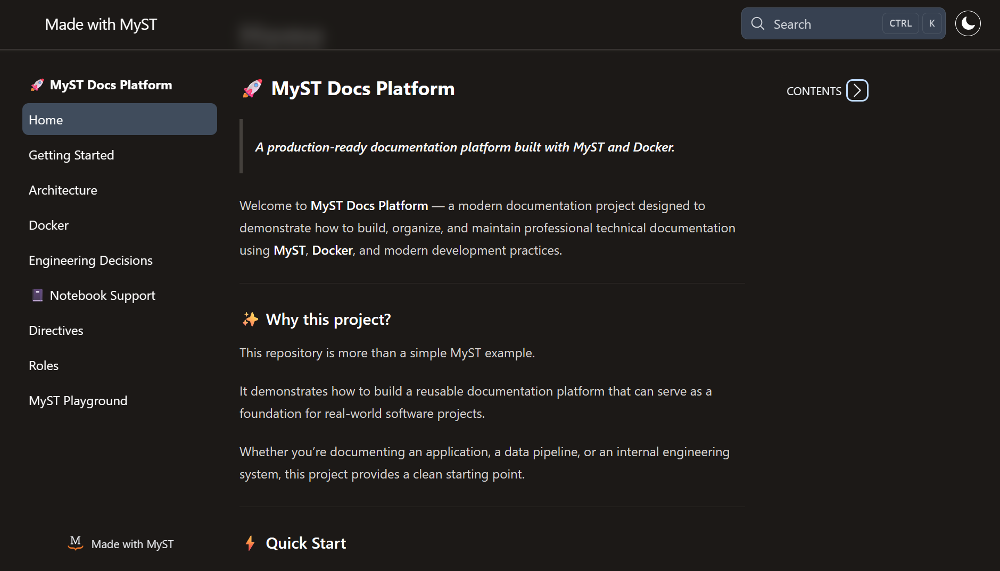

# 🚀 MyST Docs Platform

> **Production-style documentation platform built with MyST, Docker, and Jupyter Notebooks.**


---

# 📖 Overview

**MyST Docs Platform** is a hands-on project that demonstrates how to build a modern technical documentation platform using MyST.

The project combines documentation, Docker, Git, Python, and MyST into a reusable platform that can serve as a starting point for future documentation projects.

This repository is designed both as a learning project and as a portfolio project showcasing modern documentation workflows and engineering best practices.

---

# ✨ Features

- 🐳 Docker-based development environment
- ⚡ Live Preview (automatic reload)
- 📝 MyST Markdown
- 📚 Multi-page documentation
- 📓 Jupyter Notebook Support
- 🔗 Cross References
- 📊 Mermaid diagrams
- 🧮 Mathematical equations
- 💻 Syntax highlighting
- 🧪 MyST Playground
- ⚙️ Makefile automation
- 📂 Organized project structure

---

# 📸 Preview



> Home page of the documentation platform running locally.

---

# 🚀 Quick Start

## Prerequisites

- Docker
- Docker Compose
- GNU Make *(optional)*

## Clone the repository

```bash
git clone https://github.com/YoniAfengar/myst-docs-platform.git
cd myst-docs-platform
```

## Start the development environment

```bash
make up
```

Or without Make:

```bash
docker compose up
```

Open your browser:

```text
http://localhost:3001
```

---

# 📂 Project Structure

```text
myst-docs-platform/

├── docs/                  # Documentation pages
├── Dockerfile             # Development image
├── compose.yml            # Container orchestration
├── Makefile               # Development commands
├── myst.yml               # MyST configuration
├── README.md              # Project overview
├── .gitignore
└── .dockerignore
```

---

# 🛠 Tech Stack

| Category | Technology |
|-----------|------------|
| Language | Python 3.12 |
| Documentation | MyST Markdown |
| Containers | Docker & Docker Compose |
| Interactive | Jupyter Notebook |
| Diagrams | Mermaid |
| Automation | GNU Make |
| Version Control | Git & GitHub |

---

# 📚 Documentation

Current documentation includes:

- 🏠 Home
- 🚀 Getting Started
- 🐳 Docker
- 🏗 Architecture
- ⚙️ Engineering Decisions
- 🎭 Directives
- 👥 Roles
- 🧪 Playground
- 📓 Notebook Support

---

# 🎯 Project Goals

This project was created to:

- Explore MyST features through hands-on examples
- Build a reusable documentation platform
- Demonstrate modern documentation workflows
- Document architectural decisions and best practices
- Create a portfolio-ready project

---

# 🗺 Roadmap

## ✅ Version 0.1

- Docker development environment
- MyST integration
- Multi-page documentation
- Mermaid diagrams
- Interactive Notebook support
- Playground

## 🚀 Future Versions

- Theme customization
- GitHub Actions (CI)
- PDF export
- Full-text search
- Custom themes
- Non-root Docker container

---

# 👨‍💻 Author

**Yonatan Afengar**

- GitHub: [@YoniAfengar](https://github.com/YoniAfengar)
- LinkedIn: [Yonatan Afengar](https://www.linkedin.com/in/yonatan-afengar-92bb18155)

---

# 🤝 Contributing

This repository is currently maintained as a personal learning and portfolio project.

Suggestions, ideas, and constructive feedback are always welcome.

---

# 📄 License

This project is intended for educational and portfolio purposes.