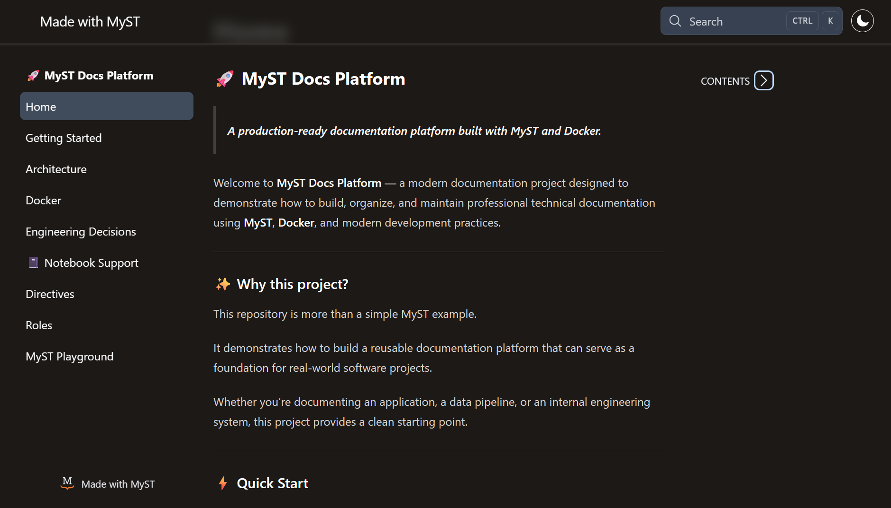
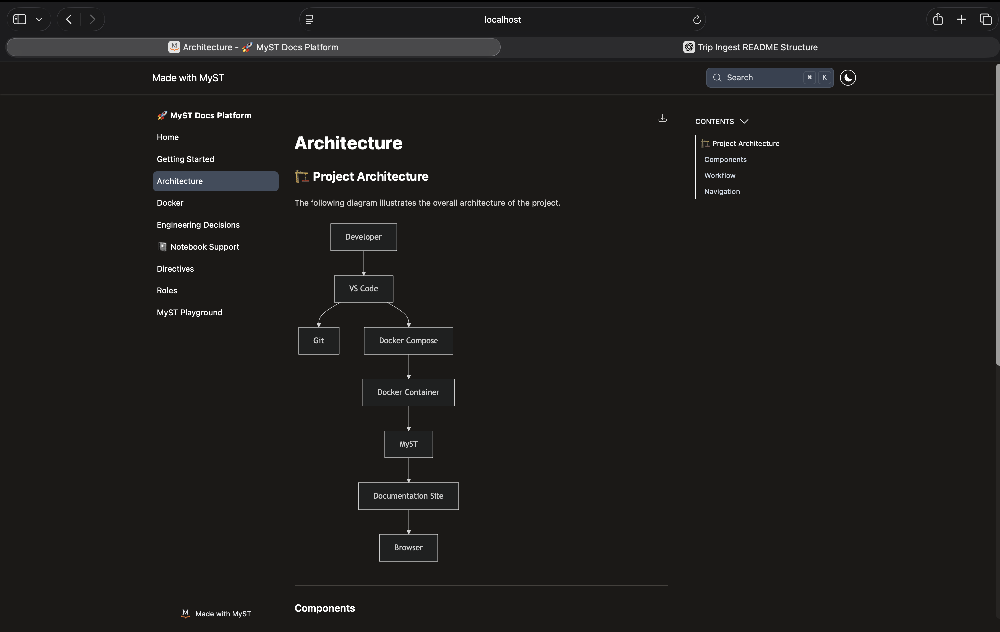
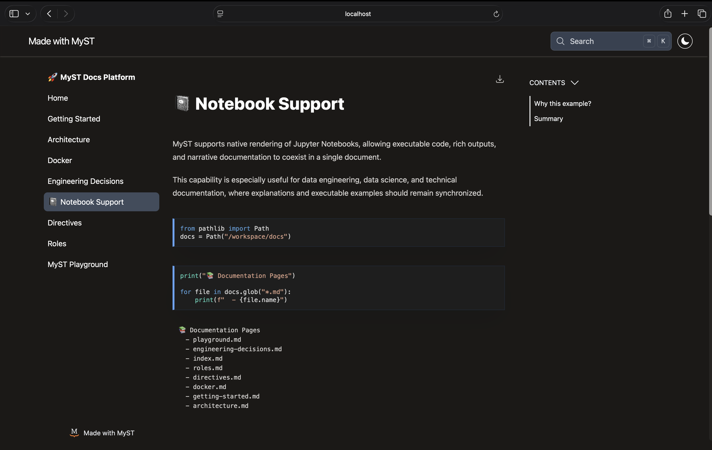
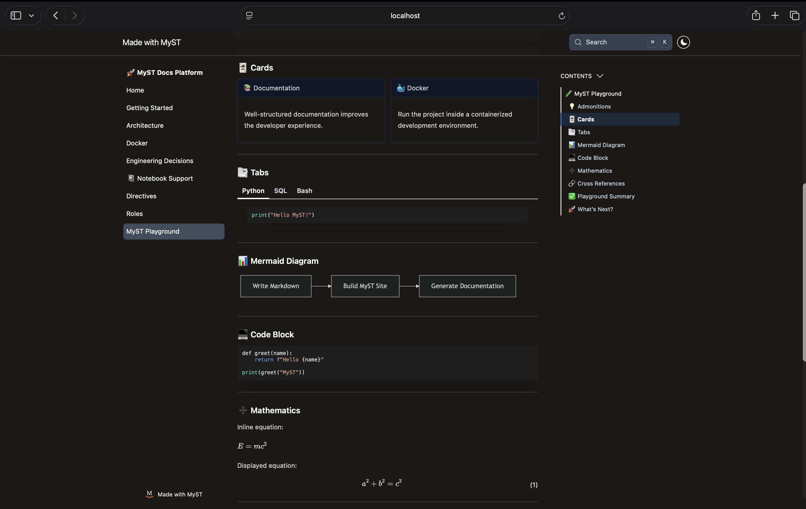

<div align="center">


# 🚀 MyST Docs Platform

**Production-style documentation platform built with MyST, Docker, and Jupyter Notebooks.**


</div>

---

# 📖 Overview

MyST Docs Platform is a portfolio-quality project demonstrating how modern technical documentation can be designed, maintained, and delivered using production-style engineering practices.

Rather than treating documentation as a collection of Markdown files, this project presents documentation as a complete platform powered by **MyST**, **Docker**, and **Jupyter Notebooks**.

The repository focuses on reproducibility, maintainability, interactive content, and developer experience while showcasing a clean documentation architecture suitable for real-world projects.

Built as part of my engineering portfolio, this repository demonstrates Documentation-as-Code principles while serving as a reusable foundation for future technical documentation projects.

---

# 📸 Preview

<p align="center">

</p>

**Home page of the documentation platform running locally.**

---

# ✨ Highlights

- 🐳 Docker-powered development environment
- ⚡ Live Preview with automatic reload
- 📝 Documentation written with MyST Markdown
- 📚 Multi-page documentation
- 📓 Native Jupyter Notebook integration
- 🔗 Cross References
- 📊 Mermaid diagrams
- 🧮 Mathematical equations
- 💻 Syntax highlighting
- 🧪 Interactive MyST Playground
- ⚙️ Makefile automation
- 📂 Clean and scalable project organization
- 🚀 Production-style development workflow

---

# 📚 Documentation Highlights

This project demonstrates several core capabilities of the MyST ecosystem through dedicated documentation pages.

Each page serves both as project documentation and as a practical example of how modern technical documentation can be structured using MyST.

---

## 🏗 Architecture

The Architecture page demonstrates how Mermaid diagrams can be used to visualize documentation workflows and project structure directly inside MyST documentation.

<p align="center">

</p>

---

## 📓 Notebook Support

Executable Jupyter Notebooks are fully integrated into the documentation, allowing code, output, and explanatory text to coexist within a single documentation platform.

<p align="center">

</p>

---

## 🧪 MyST Playground

The Playground showcases advanced MyST capabilities including cards, tabs, directives, diagrams, syntax highlighting, and mathematical notation.

<p align="center">

</p>

---
# 🛠 Tech Stack

| Category | Technologies |
|-----------|--------------|
| Documentation Engine | MyST |
| Programming | Python |
| Containerization | Docker & Docker Compose |
| Interactive Content | Jupyter Notebook |
| Diagrams | Mermaid |
| Version Control | Git & GitHub |
| Automation | GNU Make |
| Development | VS Code |

---

# 📂 Project Structure

```text
myst-docs-platform/
├── assets/
│   ├── hero.png
│   └── screenshots/
│       ├── home.png
│       ├── architecture.png
│       ├── notebook.png
│       └── playground.png
├── docs/
│   ├── index.md
│   ├── getting-started.md
│   ├── myst.md
│   ├── notebooks.md
│   ├── mermaid.md
│   ├── math.md
│   └── playground.md
├── notebooks/
├── Dockerfile
├── docker-compose.yml
├── Makefile
├── myst.yml
└── README.md
```

The repository is intentionally organized to separate documentation, assets, notebooks, and development configuration. This structure keeps the project easy to navigate, maintain, and scale as additional documentation is added.

---

# 🚀 Getting Started

## Prerequisites

Before starting, make sure you have:

- Docker
- Docker Compose
- Git
- GNU Make *(optional)*

---

## Clone the repository

```bash
git clone https://github.com/YoniAfengar/myst-docs-platform.git

cd myst-docs-platform
```

---

## Start the development environment

```bash
docker compose up --build
```

or

```bash
make preview
```

---

## Open the documentation

After the containers finish starting, open your browser:

```text
http://localhost:3001
```

The documentation will automatically reload whenever source files are modified.

---

# 📚 Documentation Pages

The project currently includes:

- 🏠 Home
- 🚀 Getting Started
- 📝 MyST Basics
- 📓 Notebook Support
- 📊 Mermaid Diagrams
- 🧮 Mathematical Equations
- 🔗 Cross References
- 🧪 MyST Playground

Each page highlights a specific capability of MyST while demonstrating practical documentation techniques and consistent project organization.

---

# 🎯 Key Objectives

The primary goals of this project are:

- Build a reusable documentation platform
- Explore the MyST ecosystem
- Practice Documentation-as-Code workflows
- Integrate executable Jupyter Notebooks
- Create reproducible Docker-based environments
- Improve developer experience through automation
- Produce portfolio-quality technical documentation
- Apply production-style engineering practices

---
# ⚙️ Engineering Decisions

This project was intentionally designed around modern documentation engineering principles rather than simply showcasing MyST syntax.

### Documentation as Code

Documentation lives alongside the source code, making it version-controlled, reviewable, and maintainable throughout the project's lifecycle.

---

### Reproducible Development Environment

The entire platform runs inside Docker, ensuring a consistent development experience regardless of the host operating system.

---

### MyST as the Documentation Engine

Instead of traditional Markdown, the project leverages MyST to unlock advanced documentation capabilities, including:

- Interactive Jupyter Notebooks
- Cross References
- Mermaid Diagrams
- Mathematical Equations
- Rich Directives
- Admonitions
- Syntax Highlighting

This enables documentation that is both expressive and maintainable.

---

### Scalable Project Structure

Documentation pages, assets, notebooks, and configuration files are organized into dedicated directories to keep the repository clean and easy to extend.

---

### Developer Experience

The development workflow emphasizes simplicity through Docker, Live Preview, and Makefile automation, allowing contributors to focus on writing documentation rather than configuring tooling.

---

# 🌟 What This Project Demonstrates

This project showcases practical experience with:

- Documentation as Code
- MyST Markdown
- Docker & Docker Compose
- Python
- Jupyter Notebook Integration
- Mermaid Diagrams
- Git & GitHub
- Documentation Architecture
- Technical Writing
- Engineering Best Practices

Rather than focusing on a single technology, this repository demonstrates how modern documentation tooling can be combined into a reusable, production-style documentation platform.

---

# 🚀 Future Improvements

Potential future enhancements include:

- GitHub Actions CI/CD
- Automatic deployment to GitHub Pages
- Documentation versioning
- Full-text search
- API documentation examples
- Interactive tutorials
- Documentation quality checks
- Link validation
- Custom themes

---

# 🤝 Contributing

Contributions, ideas, and improvements are always welcome.

Feel free to open an issue or submit a pull request if you'd like to help improve the project.

---

# 📄 License

This project is licensed under the MIT License.

See the **LICENSE** file for more information.

---

# 👨‍💻 Author

**Yonatan Afengar**

Senior BI Developer with 5+ years of experience designing enterprise BI and data integration solutions.

Currently expanding into modern Data Engineering through hands-on portfolio projects focused on Python, Docker, Linux, SQL, and engineering best practices.

🔗 **GitHub:** https://github.com/YoniAfengar

---

<div align="center">

### ⭐ If you found this project useful, consider giving it a star.

Built with ❤️ using **MyST**, **Docker**, and **Jupyter Notebooks**.

</div>
