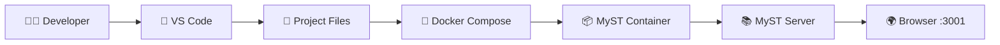

# 🏗 Project Architecture

This page explains how the different components of the project work together.

---

## High-Level Overview

---

## Component Overview

| Component | Responsibility |
|-----------|----------------|
| Developer | Writes and edits the documentation |
| VS Code | Main development environment |
| Project Files | Markdown files, configuration and Docker files |
| Docker Compose | Starts and manages the development environment |
| MyST Container | Runs the MyST documentation server |
| Browser | Displays the generated documentation |

---

## Development Workflow

The project follows a simple development workflow:

1. Edit documentation in VS Code.
2. Files are immediately synchronized into the Docker container.
3. MyST detects file changes.
4. Documentation is rebuilt automatically.
5. Refresh the browser to view the latest version.

---

## Why Docker?

Using Docker provides several advantages:

- Consistent development environment
- No local dependency installation
- Easy onboarding
- Isolated runtime
- Reproducible builds

---

## Future Improvements

- GitHub Actions for automatic documentation builds
- PDF export pipeline
- Versioned documentation
- Search integration
- Custom MyST theme