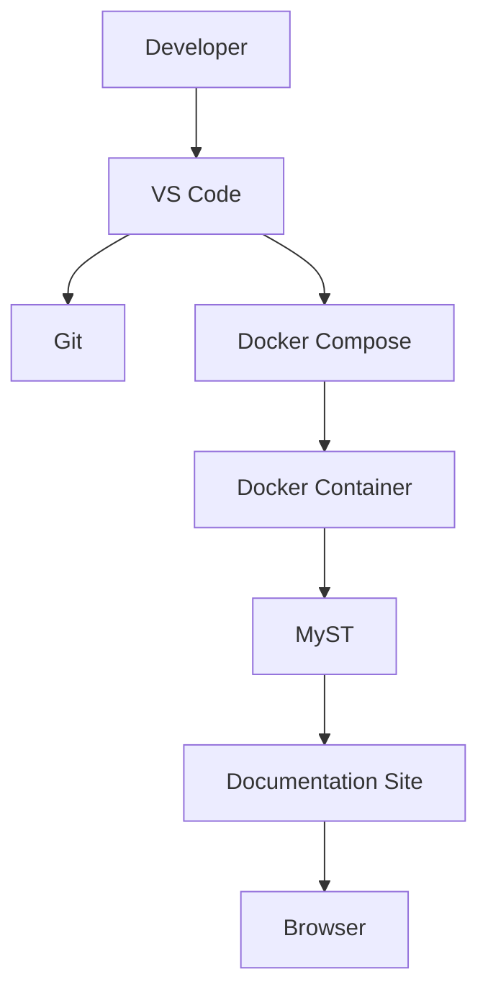

# 🏗 Project Architecture

The following diagram illustrates the overall architecture of the project.

---

## Components

| Component | Responsibility |
|-----------|----------------|
| VS Code | Source code editing |
| Git | Version control |
| Docker Compose | Development environment |
| Docker | Runtime container |
| MyST | Documentation engine |
| Browser | Documentation preview |

---

## Workflow

1. Edit the documentation.
2. Save the file.
3. MyST rebuilds automatically.
4. Refresh the browser.
5. Commit the changes.
6. Push to GitHub.

---

## Navigation

⬅ Previous: Docker

➡ Next: Engineering Decisions