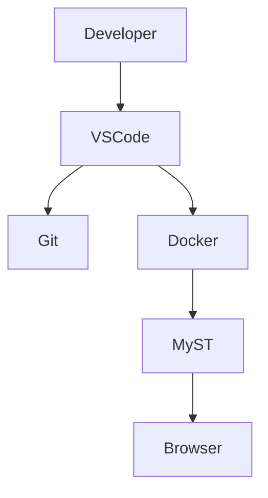

# 🧪 MyST Playground

Welcome to the MyST Playground.

This page demonstrates the most commonly used MyST features with real examples.

---

# 💡 Admonitions

Admonitions help highlight important information.

## Tip

:::{tip}
Always keep your documentation close to your code.
:::

## Note

:::{note}
Documentation should evolve together with the project.
:::

## Warning

:::{warning}
Outdated documentation is often worse than no documentation.
:::

---

# 💻 Code Highlighting

Python

```python
def fibonacci(n):
    if n <= 1:
        return n
    return fibonacci(n - 1) + fibonacci(n - 2)

print(fibonacci(8))
```

Docker Compose

```yaml
services:
  docs:
    build: .
    ports:
      - "3001:3000"
```

Bash

```bash
make up
make logs
make shell
```

---

# 📊 Mermaid Diagram



---

# 📋 Tables

| Feature | Supported |
|----------|-----------|
| Markdown | ✅ |
| MyST Directives | ✅ |
| Mermaid | ✅ |
| Docker | ✅ |
| Math | ✅ |

---

# 🧮 Mathematics

Inline equation:

$E = mc^2$

Block equation:

$$
\sum_{i=1}^{n} i=\frac{n(n+1)}{2}
$$

---

# ✅ Task List

- [x] Docker
- [x] Git
- [x] MyST
- [x] Mermaid
- [ ] GitHub Actions
- [ ] PDF Export

---

# 📌 Quote

> Documentation is a feature, not an afterthought.

---

# 🧩 Project Tree

```text
myst-docs-platform/

├── docs/
├── Dockerfile
├── compose.yml
├── Makefile
├── myst.yml
└── README.md
```

---

# 🎯 Summary

The Playground is designed to demonstrate the core capabilities of MyST in a single place.

Each section showcases a real feature that can be used in technical documentation projects.

---

# 🖼 Figures

MyST also supports figures with captions.

```{figure} https://placehold.co/700x250/png
:alt: Placeholder image
:name: fig-placeholder

Example figure rendered by MyST.
```

---

# 🔗 Cross References

You can create links between pages in your documentation.

Example:

- Go back to the Home page.
- Continue reading the Architecture page.

Cross references help create a connected documentation experience.

---

# 📝 Footnotes

Footnotes are useful for adding additional information without interrupting the reading flow.

MyST supports footnotes naturally.[^1]

[^1]: This is an example footnote rendered by MyST.