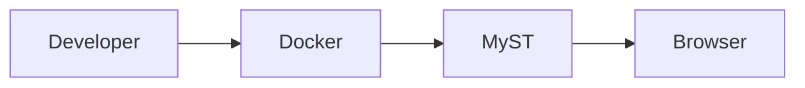

# 🧪 MyST Playground

The playground is a collection of interactive examples that demonstrate MyST features in a real project.

Instead of simply reading about a feature, you can see how it looks when rendered.

---

## 💡 Tip

:::{tip}
MyST makes technical documentation much more powerful than standard Markdown.
:::

---

## ⚠️ Warning

:::{warning}
Keep documentation synchronized with your codebase.
:::

---

## 📝 Note

:::{note}
Good documentation is part of the product.
:::

---

## 💻 Python Example

```python
def greet(name):
    return f"Hello {name}"

print(greet("Developer"))
```

---

## 🐳 Docker Example

```bash
make up
```

---

## 📊 Mermaid Example



---

## 📋 Table Example

| Feature | Supported |
|---------|-----------|
| Markdown | ✅ |
| Mermaid | ✅ |
| Tables | ✅ |
| Code Blocks | ✅ |

---

## 🧮 Mathematics

Inline:

$E = mc^2$

Block:

$$
\sum_{i=1}^{n} i = \frac{n(n+1)}{2}
$$