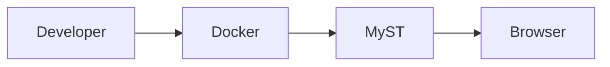

# 🧪 MyST Playground

Welcome to the MyST Playground.

This page demonstrates the core features of MyST using real examples.

---

# 💡 Admonitions

### Source

```
:::{tip}
Always document your code.
:::
```

### Result

:::{tip}
Always document your code.
:::

---

# 💻 Code Blocks

### Python

```python
def hello():
    print("Hello MyST!")
```

### Bash

```bash
make up
```

---

# 📊 Mermaid



---

# 📋 Tables

| Feature | Supported |
|----------|-----------|
| MyST | ✅ |
| Mermaid | ✅ |
| Docker | ✅ |

---

# 🧮 Mathematics

Inline:

$E = mc^2$

Display:

$$
\sum_{i=1}^{n} i = \frac{n(n+1)}{2}
$$

---

# 📝 Lists

- Item 1
- Item 2
- Item 3

---

# ✅ Checklist

- [x] Docker
- [x] MyST
- [x] Git
- [ ] GitHub Actions

---

# 🎯 Conclusion

The Playground demonstrates the most commonly used MyST capabilities in a single page.